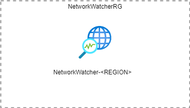

# infrastructure.azure.core.network.networkwatcher

The `infrastructure.azure.core.network.networkwatcher` repository stores the resource configuration files for
[Terraform](https://www.terraform.io/) to deploy a
[resource group](https://docs.microsoft.com/en-us/azure/azure-resource-manager/management/overview#terminology)
with an [Azure Network Watcher](https://docs.microsoft.com/en-us/azure/network-watcher/network-watcher-monitoring-overview)
to an Azure subscription so that it is possible to diagnose network issues
in Azure.

The Terraform configuration creates the following group of resources:

* One resource group to contain all the resources. Named `NetworkWatcherRG` as per Azure requirements.
* The [Azure Network Watcher](https://docs.microsoft.com/en-us/azure/network-watcher/network-watcher-monitoring-overview). Named `NetworkWatcher_<AZURE_LOCATION_SHORT>`. Where the `AZURE_LOCATION_SHORT` is the three letter abbreviation for the Azure region in which the Network watcher has been deployed.

By default the following tags are added:

* **category** - Set to the category. Defaults to `nwk-watcher`
* **environment** - Set to the environment. Defaults to `production`
* **location** - The Azure region in which the resources are created. Defaults to `Australia East`
* **source** - The commit ID of the current commit
* **version** - The version of the resources

Additional tags can be added by setting the `tags` variable as defined in the `variables.tf` file.

## Variables

* **category** - The name of the category that all the resources are running in.
* **environment** - The name of the environment that all the resources are running in.
* **location** - The full name of the Azure region in which the resources should be created.
* **meta_source** - The commit ID of the current commit from which the plan is being created. Used to tag the resources.
* **meta_version** - The version of the infrastructure as it is being generated. Used to tag the resources.
* **subscription_production** - The subscription ID of the production subscription. Used to find the log analytics resources.
* **subscription_test** - The subscription ID of the test subscription.
* **tags** - Tags to apply to all resources created.

## Use

In order to run the Terraform configuration in this repository you need to have an Azure subscription and be [connected to that subscription](https://www.terraform.io/docs/providers/azurerm/index.html).

Once you are signed in run the Terraform [plan](https://www.terraform.io/docs/commands/plan.html) command to preview the changes that will be made.

    tf plan -var subscription_production=<SUBSCRIPTION_ID> -var subscription_test=<SUBSCRIPTION_ID> -var meta_source=<GIT_COMMIT_HASH> -var meta_version=<VERSION> -out ./build/tf/plan

When you are happy with the plan execute the plan with the Terraform [apply](https://www.terraform.io/docs/commands/apply.html) command.

    tf apply ./build/tf/plan